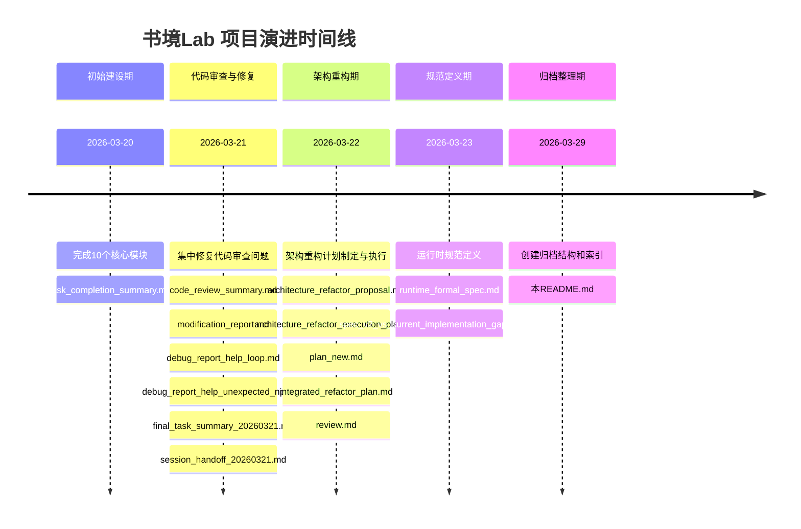

# 历史文档归档区

> 📁 本文档为历史归档索引，记录项目演进过程中的重要里程碑文档
> 
> **适用范围**: 本目录 (`docs/old/`) 包含的所有历史文档  
> **最后更新**: 2026-03-29  
> **维护状态**: 只读归档，不再更新

---

## 1. 归档说明

### 1.1 什么是归档区

`docs/old/` 文件夹是 **AI Reading Lab（书境Lab）** 项目的**历史文档归档区**，存放项目从COC文字冒险游戏框架演进过程中产生的各类阶段性文档。

### 1.2 文档生命周期

```
活跃开发 → 阶段性文档 → 历史归档 → （可选）标记废弃
    ↑                                    ↓
  当前有效文档                      参考价值评估
```

### 1.3 参考价值评级说明

| 评级 | 含义 | 使用建议 |
|:---:|:---|:---|
| ⭐⭐⭐⭐⭐ **高** | 当前仍然有效或具有重要参考价值 | 优先查阅，可作为工作基准 |
| ⭐⭐⭐⭐ **中高** | 大部分内容仍适用，部分细节可能过时 | 结合当前代码对照阅读 |
| ⭐⭐⭐ **中** | 部分有价值，需要批判性阅读 | 关注分析框架和方法论 |
| ⭐⭐ **低** | 基本过时，仅具历史追溯意义 | 用于理解项目演进历史 |
| ⭐ **无** | 已完全废弃，无参考价值 | 不建议查阅 |

### 1.4 状态标识

- **✅ 已完成**: 提案/计划已落实，任务已完成
- **⚠️ 部分过时**: 部分内容已不适用，但仍有参考价值
- **❌ 已废弃**: 提案/设计已被废弃或完全替代

---

## 2. 文档总览表

### 2.1 按阶段分类

#### 📁 01_initial_design - 初始设计阶段

项目初期概念设计和原始规范文档。

| 文档名称 | 创建日期 | 核心主题 | 参考价值 | 状态 |
|:---|:---:|:---|:---:|:---:|
| [项目说明文档（1.0）.md](./项目说明文档（1.0）.md) | 2026-03-20前 | 书境Lab项目整体概念设计、架构初稿 | ⭐⭐⭐ 中 | ⚠️ 部分过时 |
| [spec_v2_simplified.md](./spec_v2_simplified.md) | 2026-03-20前 | COC框架原始Spec V2规范 | ⭐⭐⭐ 中 | ⚠️ 部分过时 |

---

#### 📁 02_refactor_planning - 重构规划阶段

架构重构相关的提案、计划和执行方案。

| 文档名称 | 创建日期 | 核心主题 | 参考价值 | 状态 |
|:---|:---:|:---|:---:|:---:|
| [architecture_refactor_proposal.md](./architecture_refactor_proposal.md) | 2026-03-22 | 架构重构原始提案（统一NPC模式、叙事系统） | ⭐⭐ 低 | ✅ 已完成 |
| [architecture_refactor_execution_plan.md](./architecture_refactor_execution_plan.md) | 2026-03-22 | 重构执行计划与可行性分析 | ⭐⭐ 低 | ✅ 已完成 |
| [plan_new.md](./plan_new.md) | 2026-03-22 | 重构新计划（锁定可执行边界） | ⭐⭐ 低 | ✅ 已完成 |
| [integrated_refactor_plan.md](./integrated_refactor_plan.md) | 2026-03-22 | 集成重构完整计划（综合版） | ⭐⭐ 低 | ✅ 已完成 |
| [spec_v2_vs_current_implementation_gap_analysis.md](./spec_v2_vs_current_implementation_gap_analysis.md) | 2026-03-23 | Spec V2与实现差异分析 | ⭐⭐⭐⭐ 中高 | ⚠️ 建议保留 |
| [runtime_formal_spec.md](./runtime_formal_spec.md) | 2026-03-23 | 运行时正式规范（当前代码基线文档） | ⭐⭐⭐⭐⭐ **高** | ✅ **当前有效** |

---

#### 📁 03_development - 开发实施阶段

具体开发任务、执行计划和完成总结。

| 文档名称 | 创建日期 | 核心主题 | 参考价值 | 状态 |
|:---|:---:|:---|:---:|:---:|
| [task_completion_summary.md](./task_completion_summary.md) | 2026-03-20 | 初始10个模块完成总结 | ⭐⭐ 低 | ⚠️ 历史价值 |
| [debug_plan_alignment.md](./debug_plan_alignment.md) | 2026-03-21 | 代码审查问题Debug计划 | ⭐⭐ 低 | ✅ 已完成 |
| [final_task_summary_20260321.md](./final_task_summary_20260321.md) | 2026-03-21 | 3月21日任务最终总结 | ⭐⭐ 低 | ✅ 已完成 |
| [modification_report.md](./modification_report.md) | 2026-03-21 | 代码修改意见汇总报告 | ⭐⭐⭐ 中 | ⚠️ 部分过时 |

---

#### 📁 04_debugging - 调试验证阶段

Bug修复记录、调试报告和问题分析。

| 文档名称 | 创建日期 | 核心主题 | 参考价值 | 状态 |
|:---|:---:|:---|:---:|:---:|
| [code_review_summary.md](./code_review_summary.md) | 2026-03-21 | 代码审查问题总结（6-10号问题） | ⭐⭐⭐ 中 | ⚠️ 部分过时 |
| [debug_report_help_loop.md](./debug_report_help_loop.md) | 2026-03-21 | `\help`循环报错Debug报告 | ⭐⭐ 低 | ✅ 已修复 |
| [debug_report_help_unexpected_npc.md](./debug_report_help_unexpected_npc.md) | 2026-03-21 | `\help`意外触发NPC问题报告 | ⭐⭐ 低 | ✅ 已修复 |

---

#### 📁 05_handoff - 总结交接阶段

任务总结、交接文档和系统性审查。

| 文档名称 | 创建日期 | 核心主题 | 参考价值 | 状态 |
|:---|:---:|:---|:---:|:---:|
| [session_handoff_20260321.md](./session_handoff_20260321.md) | 2026-03-21 | 3月21日任务交接文档 | ⭐⭐ 低 | ✅ 已完成 |
| [review.md](./review.md) | 2026-03-22 | 代码审查与问题汇总（系统级） | ⭐⭐⭐⭐ 中高 | ⚠️ 建议保留 |
| [建议文档.md](./建议文档.md) | 2026-03-20前 | 规范符合性审查与修改建议 | ⭐⭐⭐ 中 | ⚠️ 部分过时 |
| [终端信息_new.md](./终端信息_new.md) | 2026-03-21 | CLI终端输出示例 | ⭐⭐ 低 | ⚠️ 示例性质 |

---

### 2.2 按参考价值排序

#### ⭐⭐⭐⭐⭐ 高参考价值（当前有效/关键参考）

| 文档 | 阶段 | 说明 |
|:---|:---:|:---|
| [runtime_formal_spec.md](./runtime_formal_spec.md) | 重构规划 | **当前运行时权威规范**，定义引擎启动、主链路、NPC响应模式等正式行为 |

#### ⭐⭐⭐⭐ 中高参考价值

| 文档 | 阶段 | 说明 |
|:---|:---:|:---|
| [spec_v2_vs_current_implementation_gap_analysis.md](./spec_v2_vs_current_implementation_gap_analysis.md) | 重构规划 | 理解从Spec V2到当前实现的演进关键，含详细差异对比 |
| [review.md](./review.md) | 总结交接 | 系统性根因分析和改进路线图，含跨问题分析和改进计划 |

#### ⭐⭐⭐ 中等参考价值

| 文档 | 阶段 | 说明 |
|:---|:---:|:---|
| [项目说明文档（1.0）.md](./项目说明文档（1.0）.md) | 初始设计 | 项目原始概念和设计理念，技术栈假设有差异 |
| [spec_v2_simplified.md](./spec_v2_simplified.md) | 初始设计 | 原始Spec V2，基础数据流和架构设计仍适用 |
| [modification_report.md](./modification_report.md) | 开发实施 | 根因分析部分仍有价值，问题分类框架有用 |
| [code_review_summary.md](./code_review_summary.md) | 调试验证 | 问题分类和审查框架有用 |
| [建议文档.md](./建议文档.md) | 总结交接 | 审查框架和规范对比方法仍有参考价值 |

#### ⭐⭐ 低参考价值（历史归档）

| 文档 | 阶段 | 说明 |
|:---|:---:|:---|
| [architecture_refactor_proposal.md](./architecture_refactor_proposal.md) | 重构规划 | 提案已落实，历史价值为主 |
| [architecture_refactor_execution_plan.md](./architecture_refactor_execution_plan.md) | 重构规划 | 执行计划已完成，历史价值为主 |
| [plan_new.md](./plan_new.md) | 重构规划 | 决策已落地实施 |
| [integrated_refactor_plan.md](./integrated_refactor_plan.md) | 重构规划 | 综合计划已执行完成 |
| [task_completion_summary.md](./task_completion_summary.md) | 开发实施 | 初始阶段完成总结，后续已有大量重构 |
| [debug_plan_alignment.md](./debug_plan_alignment.md) | 开发实施 | Debug计划已完成 |
| [final_task_summary_20260321.md](./final_task_summary_20260321.md) | 开发实施 | 3月21日任务总结 |
| [debug_report_help_loop.md](./debug_report_help_loop.md) | 调试验证 | 问题已修复，历史记录 |
| [debug_report_help_unexpected_npc.md](./debug_report_help_unexpected_npc.md) | 调试验证 | 问题已修复，历史记录 |
| [session_handoff_20260321.md](./session_handoff_20260321.md) | 总结交接 | 任务交接文档 |
| [终端信息_new.md](./终端信息_new.md) | 总结交接 | CLI输出示例，格式可能已迭代 |

---

## 3. 使用指南

### 3.1 什么时候查阅这些文档

| 场景 | 推荐文档 | 原因 |
|:---|:---|:---|
| **了解当前运行时规范** | [runtime_formal_spec.md](./runtime_formal_spec.md) | 唯一高参考价值文档，定义当前代码行为 |
| **理解项目演进历史** | [spec_v2_vs_current_implementation_gap_analysis.md](./spec_v2_vs_current_implementation_gap_analysis.md) | 详细记录从V2到当前的演进路径 |
| **进行系统性改进** | [review.md](./review.md) | 含根因分析和改进路线图 |
| **研究早期设计决策** | [项目说明文档（1.0）.md](./项目说明文档（1.0）.md) + [spec_v2_simplified.md](./spec_v2_simplified.md) | 原始设计理念和架构 |
| **追溯Bug修复历史** | `04_debugging/` 目录下各报告 | 具体问题修复记录 |
| **了解重构决策过程** | `02_refactor_planning/` 目录下各文档 | 重构提案和计划演进 |

### 3.2 阅读建议

1. **优先查阅高参考价值文档**：[runtime_formal_spec.md](./runtime_formal_spec.md) 是唯一标记为"当前有效"的文档
2. **批判性阅读过时文档**：标注"部分过时"的文档需要结合当前代码对照阅读
3. **关注方法论而非具体实现**：过时文档中的分析框架、问题分类方法可能比具体代码更有价值
4. **追踪决策演进**：对比不同日期的文档，理解决策如何随项目发展而变化

### 3.3 不应依赖的情况

- ❌ 不要将这些文档作为**当前开发工作的直接依据**（除非明确标记为"当前有效"）
- ❌ 不要将这些文档中的**技术栈假设**视为当前标准
- ❌ 不要将这些文档中的**接口定义**作为API契约（可能已变更）

---

## 4. 项目时间线总览



---

## 5. 文档迁移方案

### 5.1 建议的子目录结构

```
docs/old/
├── README.md                           # 本索引文件（保留在根目录）
│
├── 01_initial_design/                  # 初始设计阶段
│   ├── 项目说明文档（1.0）.md
│   └── spec_v2_simplified.md
│
├── 02_refactor_planning/               # 重构规划阶段
│   ├── architecture_refactor_proposal.md
│   ├── architecture_refactor_execution_plan.md
│   ├── plan_new.md
│   ├── integrated_refactor_plan.md
│   ├── spec_v2_vs_current_implementation_gap_analysis.md
│   └── runtime_formal_spec.md          # ⚠️ 建议：移至 docs/spec/
│
├── 03_development/                     # 开发实施阶段
│   ├── task_completion_summary.md
│   ├── debug_plan_alignment.md
│   ├── final_task_summary_20260321.md
│   └── modification_report.md
│
├── 04_debugging/                       # 调试验证阶段
│   ├── code_review_summary.md
│   ├── debug_report_help_loop.md
│   └── debug_report_help_unexpected_npc.md
│
└── 05_handoff/                         # 总结交接阶段
    ├── session_handoff_20260321.md
    ├── review.md
    ├── 建议文档.md
    └── 终端信息_new.md
```

### 5.2 特殊处理建议

#### 建议移至 docs/spec/ 的文档

| 文档 | 建议操作 | 理由 |
|:---|:---|:---|
| [runtime_formal_spec.md](./runtime_formal_spec.md) | **移动** 至 `docs/spec/runtime_formal_spec.md` | 当前有效规范，应作为正式Spec维护 |

#### 建议标记为废弃的文档

以下文档可考虑添加 `_OBSOLETE` 前缀以明确标识：

| 文档 | 理由 |
|:---|:---|
| `建议文档.md` → `_OBSOLETE_建议文档.md` | 审查建议已大部分落实，剩余部分可能已不适用 |
| `终端信息_new.md` → `_OBSOLETE_终端信息_new.md` | 纯示例性质，且格式可能已过时 |

### 5.3 迁移检查清单

迁移执行前请确认：

- [ ] 已备份所有文档
- [ ] 已更新所有内部交叉引用链接
- [ ] 已通知团队成员目录结构变更
- [ ] 已更新 `.gitignore`（如需要）
- [ ] 已验证 [runtime_formal_spec.md](./runtime_formal_spec.md) 在新位置可正常访问

---

## 6. 维护与更新

### 6.1 归档区维护原则

1. **只读原则**: 归档区内文档原则上不再修改，仅作历史参考
2. **追加原则**: 如需补充说明，以新文档形式追加，不修改原文
3. **索引更新**: 本README.md可根据需要更新（如添加新的归档文档引用）

### 6.2 新增归档文档流程

当需要将新文档加入归档区时：

1. 评估文档所属阶段（01-05）
2. 按命名规范放置到对应子目录
3. 更新本README.md的文档总览表
4. 标注创建日期、核心主题、参考价值评级和状态

---

## 附录：文档命名对照表

| 原始文件名 | 建议归档位置 | 备注 |
|:---|:---|:---|
| 项目说明文档（1.0）.md | 01_initial_design/ | 含中文括号，保持原样 |
| spec_v2_simplified.md | 01_initial_design/ | - |
| architecture_refactor_proposal.md | 02_refactor_planning/ | - |
| architecture_refactor_execution_plan.md | 02_refactor_planning/ | - |
| plan_new.md | 02_refactor_planning/ | - |
| integrated_refactor_plan.md | 02_refactor_planning/ | - |
| spec_v2_vs_current_implementation_gap_analysis.md | 02_refactor_planning/ | 文件名较长，建议保持 |
| runtime_formal_spec.md | **docs/spec/** ⚠️ | 建议移出归档区 |
| task_completion_summary.md | 03_development/ | - |
| debug_plan_alignment.md | 03_development/ | - |
| final_task_summary_20260321.md | 03_development/ | - |
| modification_report.md | 03_development/ | - |
| code_review_summary.md | 04_debugging/ | - |
| debug_report_help_loop.md | 04_debugging/ | - |
| debug_report_help_unexpected_npc.md | 04_debugging/ | 文件名较长，建议保持 |
| session_handoff_20260321.md | 05_handoff/ | - |
| review.md | 05_handoff/ | - |
| 建议文档.md | 05_handoff/ | 含中文名，保持原样 |
| 终端信息_new.md | 05_handoff/ | 含中文名，保持原样 |

---

> **文档版本**: 1.0  
> **创建日期**: 2026-03-29  
> **维护者**: AI Reading Lab 项目团队  
> **最后更新**: 2026-03-29
